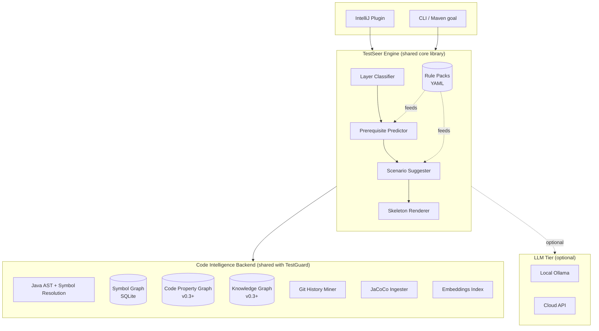
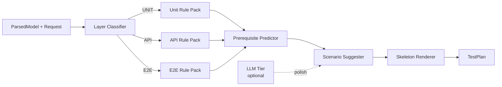
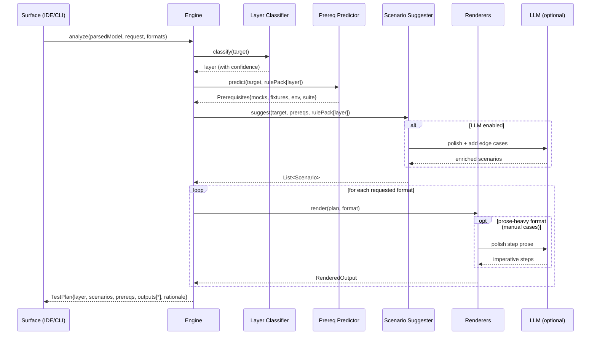
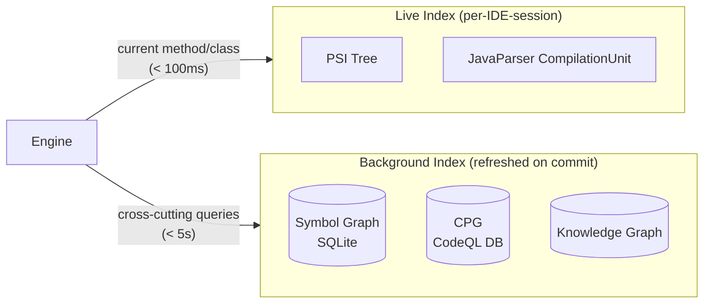
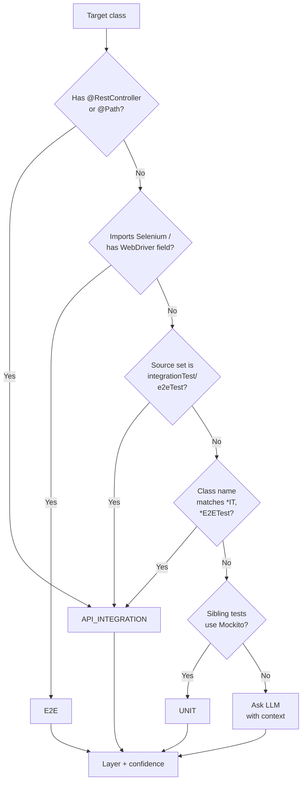

# TestSeer — Architecture Document

> **Status:** Historical — v0.1 engine design; **source not in this workspace**  
> **Last verified:** 2026-06-05  
> **Superseded by:** [TestSeer_Phase1_Architecture.md](../testseer-backend/docs/TestSeer_Phase1_Architecture.md) for platform; [CURRENT_STATUS.md](CURRENT_STATUS.md) for what runs today

**Version:** 0.1 (Design Draft)
**Date:** 2026-04-27
**Codename:** TestSeer (placeholder; rename freely)
**Related:** TestGuard PRD v3.0 (sibling product, shared backend)

---

## 1. Purpose

TestSeer is a **test planning copilot** for QA engineers working in Java + TestNG codebases. Given a target class, method, or PR diff, it emits:

- **Test prerequisites** — mocks to declare, fixtures to build, environment setup (Testcontainers, WireMock, WebDriver), TestNG suite/group configuration
- **Test scenarios** — happy path, boundary, error, concurrency, idempotency, layer-appropriate
- **A runnable TestNG skeleton** — a compilable starting point the engineer fills in with assertions
- **Manual test cases** — step-by-step natural-language test cases (Markdown, Excel/CSV) for human execution by manual QA, UAT, or pre-automation exploration
- **Rationale** — why each choice was made, so trust accrues over time

It is the **predictive sibling** to TestGuard (which evaluates already-written tests). The two products share a Code Intelligence Backend; they have different UX, output schemas, and prediction engines.

This document covers the v0.1 → v0.3 architecture. Bug-prediction features (hotspots, change-impact, missing-test gaps) are part of the long-term roadmap but are scoped after v0.3.

---

## 2. Scope at a glance

| Capability | v0.1 | v0.2 | v0.3 | v0.4+ |
|---|---|---|---|---|
| API integration prereq predictor | ✓ | ✓ | ✓ | ✓ |
| Unit-test prereq predictor (Mockito-style; opt-in) | — | — | ✓ | ✓ |
| E2E (Selenium) prereq predictor | — | — | ✓ | ✓ |
| Layer classifier | ✓ (heuristic) | ✓ | ✓ (refined) | ✓ |
| Scenario suggester (deterministic) | ✓ | ✓ | ✓ | ✓ |
| Scenario suggester (LLM-augmented) | — | ✓ | ✓ | ✓ |
| TestNG skeleton renderer | ✓ | ✓ | ✓ | ✓ |
| Manual test case renderer — API (Markdown, Confluence-friendly) | ✓ | ✓ | ✓ | ✓ |
| Manual test case renderer — E2E | — | — | ✓ | ✓ |
| Gherkin (.feature) export | — | (opt-in) | ✓ | ✓ |
| Confluence API exporter (direct page publish) | — | — | ✓ | ✓ |
| Persistent symbol graph | — | ✓ | ✓ | ✓ |
| Code Property Graph (CFG/DFG) | — | — | ✓ | ✓ |
| Doc/PRD knowledge graph (graphify-style) | — | — | ✓ | ✓ |
| Change-impact predictor | — | — | — | ✓ |
| Bug hotspot scorer | — | — | — | ✓ |
| Missing-test-gap finder | — | — | — | ✓ |
| IntelliJ plugin | ✓ | ✓ | ✓ | ✓ |
| CLI / Maven goal | ✓ | ✓ | ✓ | ✓ |

### 2.5 Target stack (v0.1)

The pilot stack is locked. Rule packs, templates, and detection logic in v0.1 assume this stack; supporting alternative stacks is a v0.2+ exercise.

| Layer | v0.1 target | Notes |
|---|---|---|
| **JDK** | Eclipse Temurin 17 | Records, sealed interfaces, text blocks, `var` all assumed available in generated skeletons |
| **Spring** | Spring Boot 3.x / Spring Framework 6.x | `jakarta.*` namespace (not `javax.*`). New `RestClient` and `WebClient` detected; deprecated `RestTemplate` still recognized |
| **TestNG** | 7.8+ | Required for Spring 6 + Java 17 compatibility. Listener: `SpringTestNGListener` or extends `AbstractTestNGSpringContextTests` |
| **HTTP service mocking** | **Pluggable** via `MockProvider` SPI | v0.1 ships two adapters: **WireMock 3.x** (default) and a **templated adapter for in-house Java mock services** (the pilot team has one of these in at least one environment). Outbound HTTP detection emits abstract `StubSpec` objects; the configured provider renders them at skeleton-generation time. See §7.2 |
| **Test-side HTTP client** | REST-Assured 5.x | For driving the system under test. `MockMvc` / `WebTestClient` supported as alternatives where Spring slices are detected |
| **Persistence test infra** | Testcontainers (Postgres / MySQL / Kafka / LocalStack as detected) | Triggered by JPA entities, `@KafkaListener`, S3 / SQS clients in the application code |
| **Build tool** | **Maven 3.9+** | Resolved §12.3. Plugin packaged as `io.testseer:testseer-maven-plugin`. Integration tests follow the maven-failsafe convention (`*IT.java` in `src/test/java`); separate `integration-test` profile or submodule both supported |
| **Object-level mocking** | Out of scope for v0.1 | Mockito and friends are not the v0.1 mocking primitive. Unit-test rule pack ships in v0.3 as opt-in |

**Stack-driven design choices in v0.1:**

- **Mocking is pluggable**, not WireMock-specific. The rule pack emits abstract `StubSpec` objects (method, URL pattern, response shape, request matchers). A `MockProvider` SPI renders them per the project's chosen tool. Auto-detected from build dependencies; overridable via `.testseer/config.yml`.
- **Default skeleton shape (WireMock adapter)** is `@SpringBootTest(webEnvironment = RANDOM_PORT)` + `@AutoConfigureWireMock(port = 0)` + REST-Assured + `AbstractTestNGSpringContextTests`. The pilot's in-house Java mock service gets a different skeleton via the templated adapter — same plan, different rendering.
- **Outbound-call detection** scans for `RestClient.create()`, `WebClient.builder()`, `RestTemplate`, and Feign clients. Each detected outbound call generates a `StubSpec`; the rendering depends on the provider.
- **Fixture range derivation** reads `jakarta.validation.constraints.*` annotations on DTOs (replacing `javax.validation` heritage from Spring 5).
- **Generated Java idioms** — text blocks for inline JSON in stubs, records for fixtures where types permit, `var` for local declarations, switch expressions where helpful.

---

## 3. System architecture

### 3.1 High-level view



**Reading the diagram:**
- Two surfaces (IntelliJ plugin, CLI) are thin shells over the engine.
- The engine is a pure Java/Kotlin library — no IDE dependencies, no I/O. It takes a `ParsedModel` and a request, returns a `TestPlan`.
- The Code Intelligence Backend is shared infrastructure. v0.1 ships only the AST + symbol-resolution layer; later versions add the persisted graph, CPG, and knowledge graph.
- LLM is opt-in. Local Ollama is the default to preserve privacy and zero out incremental cost.

### 3.2 Why this shape

Three constraints drove the architecture:

1. **Two surfaces, one engine.** IntelliJ + CLI both do the same job; the engine must be reusable. This forces a clean engine API and prevents IDE-specific logic from leaking everywhere.
2. **Local-first by default.** QA engineers in regulated industries can't ship code to OpenAI. Most of the predictor (~70–80%) is deterministic; the LLM is reserved for the genuinely hard parts.
3. **Shared backend with TestGuard.** Bothproducts read from the same code intelligence layer. Designing it as a separate library ensures future products (release-risk reports, reviewer suggestions) can plug in without rebuilding the indexing.

---

## 4. Component architecture

### 4.1 Code Intelligence Backend

Shared infrastructure consumed by both TestSeer and TestGuard.

**Responsibilities:**
- Parse Java source to AST + resolved symbol references
- Maintain a persisted **symbol graph** (v0.2+): classes, methods, fields, packages, calls, inherits, instantiates, imports, annotations
- Mine git history for bug-fix commits and co-change patterns
- Ingest JaCoCo coverage when available
- Maintain function-level embedding index for similarity / RAG
- (v0.3+) Build a Code Property Graph layered on top — adds CFG, DFG, exception flow
- (v0.3+) Ingest docs/PRDs/transcripts into a knowledge graph (graphify-inspired)

**Tooling decisions:**
| Concern | Choice | Rationale |
|---|---|---|
| AST parsing | **JavaParser** (CLI) / **PSI** (IDE) | JavaParser is mature, has a SymbolSolver, good performance; PSI is free inside IntelliJ |
| Persisted graph | **SQLite + recursive CTEs** | Adopts TestGuard PRD §9.6 schema; portable, embedded, no operational burden |
| CPG (v0.3+) | **CodeQL extraction** | Best Java fidelity; we own only the query layer |
| Coverage | **JaCoCo XML** | De facto standard |
| Embeddings | **sentence-transformers** (local) | Free, fast, sufficient for code/doc similarity |
| Knowledge graph (v0.3+) | **graphify-style multi-modal pass** | Fills "implicit domain knowledge" gap from TestGuard PRD §9.5 |

The backend is not in scope for v0.1 beyond the AST/symbol layer — TestSeer v0.1 reads PSI/JavaParser directly and skips graph persistence. This is the most consequential scoping decision in v0.1, so it gets its own subsection.

#### 4.1.1 v0.1: AST + symbol resolution only (no persisted graph)

The prereq predictor for a single target class needs only a *neighborhood* of facts:

1. The target class itself — annotations, fields, constructor params, method bodies
2. Resolved types for those fields and params (interfaces, superclasses, type parameters)
3. Annotations on the *resolved* types (is `OrderRepository` itself `@Repository`?)
4. Direct callees from the target's method bodies (depth-1 only)
5. Source-set siblings — existing test files for pattern detection
6. Build files and `testng.xml` for project conventions

This is "the symbol graph, but only the neighborhood around one node." Both PSI and JavaParser's SymbolSolver provide this on demand, in-memory, with no persistent backing store. We get the equivalent of a graph query for free, without owning a database.

**Inside IntelliJ — PSI**

IntelliJ has already indexed the entire project. Every reference resolution and cross-file lookup is essentially constant-time:

```kotlin
val targetClass: PsiClass = ... // from action context

// Resolve constructor params with full type info
val ctor = targetClass.constructors.first()
val deps = ctor.parameterList.parameters.map { param ->
    val resolvedClass: PsiClass? = (param.type as? PsiClassType)?.resolve()
    val isRepository = resolvedClass?.hasAnnotation(
        "org.springframework.stereotype.Repository"
    ) == true
    Dependency(param.name, param.type, mockWorthy = isRepository /* + other rules */)
}

// Walk the target method body for outbound calls (depth-1)
PsiTreeUtil.findChildrenOfType(targetMethod, PsiMethodCallExpression::class.java)
    .mapNotNull { it.resolveMethod() }
    .filter { it.containingClass != targetClass }
    .forEach { /* candidate for stub-shape inference */ }
```

PSI is the right primitive inside the IDE: instantly available, kept fresh by IntelliJ's indexer, and rich enough for the entire v0.1 rule pack.

**On the CLI — JavaParser SymbolSolver**

No IDE means no precomputed index. JavaParser's `SymbolSolver` has to be wired up with the project's classpath, parsed from `pom.xml` or `build.gradle`:

```java
TypeSolver typeSolver = new CombinedTypeSolver(
    new ReflectionTypeSolver(),                  // JDK
    new JavaParserTypeSolver(srcMain),           // src/main/java
    new JavaParserTypeSolver(srcTest),           // src/test/java
    // One JarTypeSolver per dependency JAR:
    new JarTypeSolver("/.../spring-context.jar"),
    new JarTypeSolver("/.../testng.jar")
    // ... resolved from build tool
);
StaticJavaParser.getConfiguration()
    .setSymbolResolver(new JavaSymbolSolver(typeSolver));

CompilationUnit cu = StaticJavaParser.parse(targetFile);
ClassOrInterfaceDeclaration targetClass =
    cu.findFirst(ClassOrInterfaceDeclaration.class).orElseThrow();

targetClass.getConstructors().get(0).getParameters().forEach(param -> {
    ResolvedType resolvedType = param.getType().resolve();
    // same downstream logic as PSI path
});
```

Cold-start resolution on a typical CompilationUnit takes 2–5 seconds, dominated by JAR scanning. That's fine for human-driven CLI invocation; if CI batch usage emerges later, we'd reach for a Gradle-style daemon worker process before reaching for persistence.

**Why we deliberately skip persistence in v0.1**

| Concern | Build persistence in v0.1 | Defer to v0.2 (chosen) |
|---|---|---|
| Build cost | +4–6 weeks (extractor, schema, incremental update, invalidation) | 0 |
| Risk surface | Stale graph, corrupted DB, missed invalidations all become live bugs | Zero stateful infra |
| Pilot signal | We learn whether the *backend* works | We learn whether the *predictor* works (the real question) |
| Failure recovery | We'd have built infra for capabilities not needed yet | v0.2 adds it cleanly behind the stable interface below |

The pilot question is "do QA engineers find these test plans useful?" — not "can we maintain a fresh persisted graph?" Building the backend in v0.1 would dilute that experiment with infrastructure risk.

**What v0.1 cannot do (honest list)**

- **Cross-class scenario hints** — "your caller passes `null`, test the null path" needs reverse-call lookup beyond depth-1. v0.2 adds this with the persisted graph.
- **Find similar tests** — embedding index lives in the backend. v0.2.
- **Change-impact prediction** — graph traversal across the project. v0.4.
- **Hotspot ranking** — needs git history × graph. v0.4.
- **Multi-class refactor awareness** — "this controller and its service should be tested together." v0.2.

These are accepted limitations. The v0.1 prereq predictor delivers value on a per-class basis, and that's enough to validate the product hypothesis with a pilot team.

**The interface contract that makes v0.2 swappable**

The engine never touches PSI or JavaParser directly. It depends on a narrow, scenario-driven `CodeIntelligence` interface:

```java
public interface CodeIntelligence {
    ResolvedClass     resolveClass(SymbolRef ref);
    List<ResolvedField>       getFields(SymbolRef classRef);
    List<ResolvedConstructor> getConstructors(SymbolRef classRef);
    List<ResolvedMethodCall>  findOutboundCalls(SymbolRef methodRef);   // depth-1
    List<ResolvedClass>       findSiblingTestClasses(SymbolRef classRef);
    Optional<TestNgSuiteHints> readTestNgXml(ProjectRoot root);
    BuildToolConventions      detectBuildTool(ProjectRoot root);
}
```

v0.1 ships two implementations:

- `PsiCodeIntelligence` — wraps PSI inside the IntelliJ plugin
- `JavaParserCodeIntelligence` — wraps JavaParser SymbolSolver in the CLI

v0.2 adds a third without changing the interface:

- `GraphBackedCodeIntelligence` — SQLite-backed; same methods plus *new* methods for cross-class queries (`findReverseCallers`, `findSimilarMethods`, etc.)

Surfaces choose an implementation at startup based on config. The engine code path is unchanged. **This is the abstraction that makes "skip persistence in v0.1" a safe call rather than a debt-laden shortcut** — the engine is written against capabilities, not against a particular backing store.

### 4.2 TestSeer Engine (core library)

The engine is a plain Java/Kotlin library with no IDE or I/O dependencies. It is consumed by both surfaces via a single API.

**Responsibilities:**
1. Accept a `ParsedModel` + an `AnalysisRequest`
2. Run the **Layer Classifier** to determine whether the target is unit, API, or E2E
3. Run the **Prerequisite Predictor** with the appropriate rule pack for that layer
4. Run the **Scenario Suggester** (deterministic + optional LLM polish)
5. Run the **Skeleton Renderer** to emit a TestNG class
6. Return a structured `TestPlan` with rationale

**Engine sub-components:**



**Why this pipeline shape:**
- Layer classification first — every downstream step is layer-specific. A misclassification produces a useless skeleton; trust collapses.
- Prereqs before scenarios — knowing the mock/fixture surface bounds what scenarios are testable.
- Skeleton last — a renderer over a structured plan, not free-form generation. Output is deterministic and conforms to TestNG idioms.

### 4.3 IntelliJ plugin

Thin shell on top of the engine. Built with the JetBrains Plugin SDK in Kotlin.

**Responsibilities:**
- Action: right-click a class/method → "Generate test plan (TestSeer)"
- Adapter: convert PSI tree → engine's `ParsedModel`
- Tool window with three tabs:
  - **Plan** — detected layer, scenarios with checkboxes, suggested groups
  - **Prereqs** — mocks, fixtures, env, suite config (with explanations)
  - **Skeleton** — preview of the generated class with an "Insert into test source set" button
- Settings panel: LLM mode (off / Ollama URL / cloud key), rule pack overrides, telemetry opt-in

**Why IntelliJ specifically:** PSI gives us a fully-resolved cross-file index for free. JavaParser would need to do its own classpath scan and symbol resolution every invocation — slow, memory-heavy. PSI makes the IDE experience snappy.

### 4.4 CLI / Maven goal

Thin shell on top of the engine for non-IDE use cases (CI, batch generation).

**Invocation:**
```bash
mvn testseer:plan -Dclass=com.acme.OrderController -Dlayer=auto
```
Or as a standalone CLI:
```bash
testseer plan --root ./my-repo --target com.acme.OrderController#place
```

**Responsibilities:**
- Adapter: convert JavaParser `CompilationUnit` (with classpath SymbolSolver) → engine's `ParsedModel`
- Output a `.java` file into the appropriate test source set
- Output a JSON `TestPlan` for tooling integration
- Emit non-zero exit on rule errors for CI usage

**Why CLI exists in v0.1:** primarily for CI batch ("regenerate plans for all controllers in this PR diff") and for QA engineers who prefer terminal workflows. Also keeps the engine honest — if it works only inside IntelliJ, the API is wrong.

---

## 5. Engine pipeline (detailed)



**Stage notes:**

1. **Classify** — heuristic rules (annotations, package, source set, sibling tests, testng.xml hints) give a layer + confidence. Below a threshold, the surface prompts the user to confirm.
2. **Predict prereqs** — rule pack is keyed on layer. Each rule has a precondition (AST/annotation pattern) and an emission (a structured `Prerequisite` entry).
3. **Suggest scenarios** — deterministic pass walks the method body for branches, exception paths, validation annotations, then optionally hands off to LLM for boundary discovery and business-meaningful naming.
4. **Render** — One or more renderers turn the structured `TestPlan` into concrete deliverables: TestNG skeleton, Markdown manual cases, Excel/CSV import, etc. Renderers are pluggable; see §5.5.

### 5.5 Output renderers

The engine produces a single layer-aware, scenario-rich `TestPlan`. Renderers turn that plan into concrete deliverables. v0.1 ships three renderers; the architecture supports adding more without engine changes.

**Renderer matrix:**

| Renderer | Output | Layer applicability | LLM dependency | Ships in |
|---|---|---|---|---|
| `TestNgSkeletonRenderer` | `.java` (compilable TestNG class) | All layers | Low (templates) | v0.1 |
| `ManualMarkdownRenderer` | `.md` (Confluence-friendly Markdown) | API, E2E (skip Unit) | High (prose quality) | v0.1 |
| `GherkinRenderer` | `.feature` (Cucumber/JBehave) | API, E2E | Medium | v0.2 (opt-in) |
| `ConfluencePublisher` | direct API push to Confluence space + parent page | API, E2E | High | v0.3 |

**Layer-awareness for manual cases.** Manual test cases are skipped for the Unit layer — no human runs unit tests by hand. For a unit target the engine emits a "Manual cases not applicable for Unit layer; suggesting skeleton instead" rationale and produces only the TestNG skeleton.

**Translation: code prereqs → human prose.** The same `Prerequisites` object renders very differently per format:

| Concept | Skeleton (Java) | Manual case (Markdown) |
|---|---|---|
| Mock OrderRepository | `@Mock private OrderRepository orderRepo;` | "Test database is preloaded with three orders for user `qa-customer-01`: one `PENDING`, one `SHIPPED`, one `CANCELLED`." |
| Stub paymentGateway returns approved | `when(paymentGateway.charge(any())).thenReturn(approved("txn-1"));` | "The payment gateway sandbox is configured to approve all transactions and return transaction ID `txn-1`." |
| Testcontainers Postgres | `@Container static PostgreSQLContainer postgres = ...;` | "A clean Postgres instance is provisioned and seeded with the schema from `migrations/`." |
| `@Parameters("baseUrl")` from testng.xml | `String baseUrl = System.getProperty("baseUrl");` | "API endpoint: `https://api-dev.example.com/v1` (override via `BASE_URL` env var)." |

This translation table is the **manual test case rule pack** — for each prereq type, two rendering paths.

**LLM polish in manual case rendering.** Prose quality matters far more for manual cases than for skeletons. Without LLM polish, the output is functionally correct but stiff:

> Step 1: Call POST /orders.
> Step 2: Verify response status is 200.

With LLM polish:

> **Step 1.** As an authenticated customer, submit a new order containing one in-stock item with a valid payment method.
>
> **Expected:** The system returns HTTP 200 with a unique order ID, charges the payment method exactly once, and triggers a confirmation email to the customer's registered address.

The deterministic version is acceptable as a fallback (privacy mode, no LLM). The polished version is what a manual tester actually wants. Pilot teams should be steered toward enabling local Ollama for manual case generation specifically — the privacy story holds because Ollama runs locally.

**Format selection.** The IntelliJ plugin offers checkboxes (TestNG, Manual MD, Gherkin); the CLI accepts `-Dformat=testng,manual-md`. The engine renders only requested formats, so unused renderers don't run.

**Confluence handoff (v0.1).** Pilot teams using Confluence as their manual case home don't need an API integration in v0.1. The Markdown output is deliberately constrained to syntax that round-trips cleanly through Confluence's paste-conversion (Cloud) or the Markdown macro (Server/DC):

- Standard headings, ordered/unordered lists, fenced code blocks, simple tables
- No raw HTML, no Mermaid, no admonitions, no Confluence-specific macros
- Steps as numbered ordered lists; expected results as nested blockquote or sublist
- Front-matter as a small key/value table (Title, Layer, Priority, Tags, Generated-from) — survives paste

The IntelliJ plugin gets a **"Copy as Confluence Markdown"** action that places the rendered Markdown on the clipboard, ready to paste into a new Confluence page. The engineer creates the page in the right space; structure preserves cleanly. v0.3's `ConfluencePublisher` automates this end-to-end, but the manual handoff is intentionally a one-paste operation in the meantime.

**Strategic angle: bridging manual exploration → automation.** Manual cases and TestNG skeletons share a single `TestPlan`. This means a QA engineer can:

1. Generate manual test cases for a new feature
2. Execute them by hand for one cycle, refine the cases as bugs are found
3. Re-render the *same plan* as a TestNG skeleton when ready to automate

The "same plan, different renderer" capability mirrors how QA work actually flows — exploration first, automation when the surface is stable. This is a meaningful selling point that single-format tools don't offer.

---

## 6. Data architecture

### 6.1 Two-index strategy

A single index can't serve both interactive IDE use and cross-cutting batch queries. We split:



**Live index** — what's needed to analyze a single class/method. PSI in IDE, JavaParser on CLI. No persistence, freshly resolved per request.

**Background index** — used by the heavier predictors (change-impact, scenario completeness, hotspots). Built incrementally on commit, queried read-only by the engine.

This split is the single most important architectural decision. It lets the IDE feel instant while heavier features stay tractable.

### 6.2 Symbol graph schema (v0.2)

Adopts TestGuard PRD §9.6 with minor extensions for testing.

**Node types:**
- `package`, `class`, `interface`, `method`, `field`, `annotation`, `test_class`, `test_method`

**Edge types:**
- `IMPORTS`, `CALLS`, `CALLS_ASYNC`, `INHERITS`, `IMPLEMENTS`, `INSTANTIATES`, `REFERENCES`, `ANNOTATED_WITH`, `TESTS` (test_method → method under test, when discoverable), `OVERRIDES`

**Edge properties:**
- `confidence` (0.0–1.0) — strong for resolved AST refs, weaker for heuristic test→target inference
- `source` (which extractor produced the edge)
- `last_seen_commit`

Stored in SQLite with recursive CTEs for traversal queries. At single-monorepo scale (≤5M LOC) this is fast enough; we only revisit if a team hits the wall.

### 6.3 Code Property Graph (v0.3+)

Layered on top of the symbol graph. Adds:
- **Control Flow Graph (CFG)** per method — branches, loops, exception handlers
- **Data Flow Graph (DFG)** — value reaches, parameter taint
- **Program Dependence Graph (PDG)** — combines control + data dependencies

**Build strategy:** ingest CodeQL's extraction (it has the best Java fidelity) and expose a thin Java query API. We do not write our own CPG extractor; the cost is too high relative to building TestSeer's actual value.

**What CPG unlocks:**
- Scenario completeness ("you've covered 4 of 7 branches")
- Boundary derivation from CFG + constraint annotations
- Taint-based prereq inference ("this fixture flows into a SQL query — needs SQL injection scenario")
- (Future) Change-impact accuracy via PDG slicing

### 6.4 Knowledge graph (v0.3+)

Inspired by graphify (https://github.com/safishamsi/graphify), specifically its multi-modal pass over docs, papers, image diagrams, and video transcripts.

Closes the "implicit domain knowledge" gap from TestGuard PRD §9.5. Concrete inputs:
- ADRs and design docs in `/docs`
- PRDs (Confluence/Notion exports)
- Loom recordings of design reviews (transcribed via faster-whisper)
- Architecture diagrams (multi-modal LLM pass)
- Internal wikis

**Output:** a graph linking domain concepts → code symbols. Used by the scenario suggester to surface scenarios grounded in design intent ("the design doc specifies 100 req/min per tenant — generate a rate-limit scenario").

We can either depend on graphify directly for this subsystem or replicate its three-pass approach. Decision deferred to v0.3 scoping.

### 6.5 Storage choices

| Index | Storage | Why |
|---|---|---|
| Live PSI | In-memory (IDE-managed) | IntelliJ already does this |
| Live JavaParser model | In-memory (per-CLI-invocation) | Stateless CLI |
| Symbol graph | SQLite (per-repo `.testseer/graph.db`) | Embedded, portable, recursive CTEs |
| CPG | CodeQL DB (per-repo `.testseer/codeql/`) | CodeQL's own format |
| Knowledge graph | DuckDB or SQLite + JSON columns | Simple analytical queries; bridges to NetworkX if needed |
| Embeddings | LMDB or SQLite-vec | Local, no separate vector store ops |
| Coverage | JaCoCo XML, parsed and merged into symbol graph | Standard |

No Neo4j, no Elasticsearch, no Pinecone. Single-binary deploy is a deliberate choice for local-first.

---

## 7. Per-layer rule packs

Rule packs are **YAML, data-driven, hot-reloadable**. Teams can extend them with org-specific conventions without forking the plugin. Each rule has:

```yaml
- id: spring-repository-mock
  layer: UNIT
  precondition:
    - constructor_param: { annotated_with: "@Repository", or_type_pattern: ".*Repository" }
  emit:
    - prerequisite:
        kind: MOCK
        target: "${param.name}"
        framework: MOCKITO
        annotation: "@Mock"
        rationale: "Repository — external persistence boundary, mock to isolate"
```

### 7.1 Unit layer rules (v0.2)

Detection: plain `@Service` / `@Component` / unannotated POJO with constructor injection, no `WebDriver` siblings, no `@RestController`.

**Emits:**
- `@Mock` for ctor params that are interfaces or `*Repository`/`*Service`/`*Client`/`*Gateway`/`*Template`
- `@InjectMocks` on the SUT
- `@BeforeMethod` with `MockitoAnnotations.openMocks(this)` (TestNG idiom — not `@BeforeEach`)
- Fixture builders from input types using Bean Validation annotations to derive valid ranges
- Stub-shape inference: walk method body, derive Optional vs throw vs value for each mocked call
- Spring slice escalation: detect `@Transactional`, AOP, `@EventListener` → suggest `@SpringBootTest` slice instead of plain unit

### 7.2 API integration layer rules (v0.1 — first to ship)

Detection: `@RestController` / `@Path` / class in `*.api.*` package / source set is `integrationTest`.

#### 7.2.1 Mocking abstraction — `MockProvider` SPI

All HTTP service stub generation goes through a pluggable `MockProvider` SPI. The rule pack does not know what mocking tool the project uses; it emits abstract `StubSpec` records:

```java
public record StubSpec(
    HttpMethod method,
    String urlPattern,                  // regex or literal
    int responseStatus,
    String responseBody,                // JSON literal (text block in generated code)
    Map<String, String> responseHeaders,
    List<RequestMatcher> matchers,      // body, header, query param matchers
    String rationale                    // for the prereqs panel + manual case prose
) { }
```

A `MockProvider` adapter renders `StubSpec` to the target tool's setup, stub, and verification code. v0.1 ships two adapters:

| Adapter | When used | How configured |
|---|---|---|
| `WireMockProvider` | Default. Picked when `wiremock` is on the classpath and no override is set | None — works out of the box with `@AutoConfigureWireMock` |
| `GenericJavaMockServiceProvider` | In-house Java mock services | YAML template in `.testseer/mock-providers/<name>.yml` declaring import statements, setup template, stub template, and verify template |

**Adapter selection precedence:**
1. CLI flag / IDE override — always wins (`-Dprovider=custom-java-mock`)
2. `.testseer/config.yml` — per-environment mapping (e.g., `qa-env` → `custom-java-mock`, others → `wiremock`)
3. Auto-detect from build dependencies — single match wins; multiple matches fall through
4. Default — `WireMockProvider`

**Templated adapter for the in-house mock service:**

The pilot team's Java mock service gets a YAML template that the engine consumes:

```yaml
# .testseer/mock-providers/acme-mock-service.yml
provider: acme-mock-service
imports:
  - com.acme.testing.MockService
  - com.acme.testing.StubBuilder
field_template: |
  @Autowired private MockService mockService;
setup_template: |
  // No global setup needed — stubs registered per test
stub_template: |
  mockService.stubs().register(
      StubBuilder.{{method | lower}}("{{urlPattern}}")
          .respondingWith({{responseStatus}})
          .body("""
              {{responseBody | indent(14)}}
              """)
  );
verify_template: |
  mockService.verifyOnce(
      StubBuilder.{{method | lower}}("{{urlPattern}}")
  );
teardown_template: |
  mockService.stubs().clear();
```

The team writes this YAML once per mock service. The engine renders skeletons against it without any code change. Multiple mock services per project are supported (e.g., one for payments, one for shipping); selection per-test follows the same precedence as adapter selection.

**The architectural point:** rule packs and the engine never reference WireMock or any other tool by name. All mocking syntax is delegated to `MockProvider`. New providers (MockServer, Hoverfly, in-house service #2, future tools) can be added by dropping in a new adapter — typically a YAML file, occasionally a small Java class for non-templatable behavior.

#### 7.2.2 Default skeleton shape — `WireMockProvider`

(Spring Boot 3 / TestNG 7.8 / WireMock 3 / REST-Assured 5):

```java
@SpringBootTest(webEnvironment = RANDOM_PORT)
@AutoConfigureWireMock(port = 0)
@ActiveProfiles("test")
public class OrderControllerIT extends AbstractTestNGSpringContextTests {

    @LocalServerPort int port;
    @Value("${wiremock.server.port}") int wireMockPort;

    @BeforeMethod
    public void setUp() {
        RestAssured.port = port;
        RestAssured.baseURI = "http://localhost";
    }

    @Test(groups = {"api", "regression", "orders"})
    public void place_happyPath_returns200() {
        // WireMock: payment gateway approves
        stubFor(post(urlEqualTo("/payment/charge"))
            .willReturn(okJson("""
                {"transactionId": "txn-1", "status": "APPROVED"}
                """)));

        var order = OrderFixtures.singleItemInStock().build();
        var user  = UserFixtures.activeStandardTier().build();

        given()
            .contentType("application/json")
            .header("Authorization", "Bearer " + TestTokens.forUser(user))
            .body(order)
        .when()
            .post("/orders")
        .then()
            .statusCode(200)
            .body("status",  equalTo("CONFIRMED"))
            .body("orderId", notNullValue());

        verify(postRequestedFor(urlEqualTo("/payment/charge")));
    }
    // 7 more scenarios stubbed below
}
```

#### 7.2.3 Same plan, custom Java mock rendering

The same `StubSpec` produces a different test class shape under `GenericJavaMockServiceProvider`:

```java
@SpringBootTest(webEnvironment = RANDOM_PORT)
@ActiveProfiles("test")
public class OrderControllerIT extends AbstractTestNGSpringContextTests {

    @LocalServerPort int port;
    @Autowired private MockService mockService;

    @BeforeMethod
    public void setUp() {
        RestAssured.port = port;
        RestAssured.baseURI = "http://localhost";
    }

    @AfterMethod
    public void tearDown() {
        mockService.stubs().clear();
    }

    @Test(groups = {"api", "regression", "orders"})
    public void place_happyPath_returns200() {
        // Stub registered with the in-house mock service
        mockService.stubs().register(
            StubBuilder.post("/payment/charge")
                .respondingWith(200)
                .body("""
                    {"transactionId": "txn-1", "status": "APPROVED"}
                    """));

        var order = OrderFixtures.singleItemInStock().build();
        var user  = UserFixtures.activeStandardTier().build();

        given()
            .contentType("application/json")
            .header("Authorization", "Bearer " + TestTokens.forUser(user))
            .body(order)
        .when()
            .post("/orders")
        .then()
            .statusCode(200)
            .body("status",  equalTo("CONFIRMED"))
            .body("orderId", notNullValue());

        mockService.verifyOnce(StubBuilder.post("/payment/charge"));
    }
}
```

Same scenarios, same prereqs, same rationale — only the stub registration syntax and the verification call differ. The provider pattern keeps the rule pack and the engine clean.

#### 7.2.4 What the API rule pack emits

- `@SpringBootTest(webEnvironment = RANDOM_PORT)` for full-app integration; downgrades to `@WebMvcTest` if no out-of-app dependencies are detected
- Provider-specific test-class wiring (annotations, fields, setup/teardown) — delegated to the active `MockProvider`
- REST-Assured port + baseURI wired in `@BeforeMethod`
- **`StubSpec` for every detected outbound call.** Walks method body for `RestClient`, `WebClient`, `RestTemplate`, and Feign clients; derives URL pattern, HTTP method, and a stubbed response shape from the return type. Rendering is delegated to the provider.
- Auth: derive from Spring Security config (`@PreAuthorize`, `SecurityFilterChain`, JWT decoder beans) → emit Authorization header in the REST-Assured spec
- Test data prereqs: trace controller → service → repository to identify required entities; suggest seeding via repository or `@Sql` script
- Testcontainers: JPA → Postgres/MySQL container (read from datasource config); `@KafkaListener` → Kafka container; S3 / SQS clients → LocalStack
- `@DataProvider` for status code classes: 200, 400, 401, 403, 404, 422, 500
- TestNG groups: `api`, `regression`, plus a domain group derived from controller package
- Bean Validation: `jakarta.validation.constraints.*` on DTOs drives boundary scenario generation

### 7.3 E2E layer rules (v0.3)

Detection: presence of `WebDriver` field or import; siblings use Selenium/Selenide; class in `*.e2e.*` or source set `e2eTest`; `@Test` method names match UI flow patterns.

**Emits:**
- WebDriver bootstrap in `@BeforeMethod` with browser from `@Parameters("browser")`, headless from env, WebDriverManager for binaries
- Page Object scan: look for `*Page.java` siblings → suggest reuse; if none, scaffold one from URL/route
- Login fixture: detect auth flow → suggest `loginAs(role)` helper, prefer API-based session injection over UI signup
- Test data API: setup via API call, not UI
- `@AfterMethod` cleanup: cookies, localStorage, uploaded files
- `@AfterClass` for created users
- Flaky-test guards: explicit waits with `ExpectedConditions`, optional `IRetryAnalyzer` for known-flaky integrations
- testng.xml: `parallel="methods"` with `thread-count=1` for stateful UI suites unless data-isolated

### 7.4 Layer classifier (the gate)



**Confidence threshold:** below 0.80, the IDE plugin asks the user to confirm before generating. CLI mode emits a warning and proceeds with the highest-confidence option.

**Calibration target:** ≥ 90% accuracy on a labeled corpus of 50 classes per layer (built from the pilot team's repo) before v0.1 ships.

---

## 8. Surfaces

### 8.1 IntelliJ plugin UX

```
┌─ TestSeer ──────────────────────────────────────────────┐
│ Target: com.acme.OrderController.place(Order, User)     │
│ Layer:  API_INTEGRATION  (confidence 0.92)              │
├─────────────────────────────────────────────────────────┤
│ [ Plan ] [ Prereqs ] [ Skeleton ]                       │
│                                                         │
│ Suggested scenarios (8):                                │
│  ☑ happy_path_returns_confirmation       (200)          │
│  ☑ insufficient_stock_returns_409        (409)          │
│  ☑ payment_declined_returns_402          (402)          │
│  ☑ user_blocked_returns_403              (403)          │
│  ☑ idempotency_replay_returns_same_txn   (200)          │
│  ☐ async_payment_timeout_returns_504     (504)          │
│  ☑ malformed_order_returns_400           (400)          │
│  ☑ unauthenticated_returns_401           (401)          │
│                                                         │
│ Groups: api, regression, payments                       │
│                                                         │
│              [ Insert into src/integrationTest ]        │
└─────────────────────────────────────────────────────────┘
```

The **Prereqs** tab lists mocks, fixtures, env, suite config — each with a "why" expandable rationale.

The **Skeleton** tab shows the rendered Java with syntax highlighting, copy-able, with the insert button bound to the project's TestNG source set.

### 8.2 CLI / Maven goal

```bash
$ mvn testseer:plan -Dclass=com.acme.OrderController -Dformat=java

[INFO] TestSeer 0.1.0
[INFO] Target: com.acme.OrderController.place(Order, User)
[INFO] Layer detected: API_INTEGRATION (confidence 0.92)
[INFO] Generated 8 scenarios; 3 prereq groups; 1 testng.xml entry
[INFO] Wrote: src/integrationTest/java/com/acme/OrderControllerIT.java
[INFO] Updated: src/integrationTest/resources/testng-api.xml
```

JSON output mode (`-Dformat=json`) emits the structured `TestPlan` for downstream tooling.

### 8.3 Engine API (sketch)

```java
public interface TestSeerEngine {
    TestPlan analyze(AnalysisRequest request);
}

public record AnalysisRequest(
    ParsedModel model,        // surface-specific adapter result
    SymbolRef target,         // class or method
    AnalysisOptions options   // layer hint, llm config, rule overrides
) { }

public record TestPlan(
    DetectedLayer layer,
    double layerConfidence,
    List<Scenario> scenarios,
    Prerequisites prerequisites,
    String testNgSkeleton,    // rendered Java source
    Rationale rationale,
    List<Warning> warnings    // unsupported patterns, etc.
) { }

public sealed interface ParsedModel
    permits PsiBackedModel, JavaParserBackedModel { }

public record Prerequisites(
    List<MockSpec> mocks,
    List<FixtureSpec> fixtures,
    EnvSpec env,
    SuiteSpec suite
) { }
```

The engine is stateless within a request. Caching of resolved symbols and parsed rule packs is internal.

---

## 9. LLM strategy

### 9.1 Tiering

The engine has three operating modes:

| Mode | What runs | When to use |
|---|---|---|
| **Off** | Deterministic rules only | Default. Privacy-first orgs. Air-gapped environments. |
| **Local** | Ollama with CodeLlama / Qwen2.5-Coder for scenario polish, fixture-value suggestion | Default for "with LLM" mode. Zero per-call cost. |
| **Cloud** | Claude / GPT-4o for the genuinely hard reasoning cases | Opt-in. Org admin sets API key. |

Determinism aims for ~70–80% of the predictor's output; LLM polish covers the remaining 20–30% (boundary value semantics, business-meaningful fixture data, scenario naming).

### 9.2 What the LLM does and does not do

**LLM-appropriate tasks:**
- Generate business-meaningful fixture values ("realistic Order data" beyond just "non-null")
- Name scenarios in domain language
- Suggest non-obvious edge cases ("what if the customer cancels mid-flight?")
- Polish rationale text

**Not LLM tasks:**
- Mock detection (rules are reliable; LLM hallucinates Mockito syntax)
- Layer classification primary path (rules first; LLM is a fallback for ambiguous cases)
- Skeleton rendering (templates, not generation — guarantees compilable output)
- Annotation choice (TestNG idioms are well-defined)

This split is deliberate: it keeps cost down, keeps output trustworthy, and means the product's core value isn't gated on LLM availability.

### 9.3 Cost ceiling

For a single test plan with cloud LLM in the loop: target < $0.05 per generation. Local LLM: $0. Deterministic-only: $0. Per-team monthly budget caps can be set in the IntelliJ plugin and Maven configuration.

---

## 10. Calibration & trust

The single highest product risk is **output quality not meeting QA engineer's bar**. If the first three plans they generate are 60% correct, they uninstall.

### 10.1 Acceptance metrics

Three signals tracked from v0.1 onward (telemetry opt-in, anonymized):

| Metric | Target (v0.1) | Target (v0.3) |
|---|---|---|
| Layer classifier accuracy | ≥ 90% on labeled set | ≥ 95% |
| Skeleton edit-distance (lines changed before commit) | ≤ 30% of generated lines | ≤ 15% |
| Prereq precision (% of emitted prereqs that survive review) | ≥ 80% | ≥ 90% |
| Plans generated per active user per week | ≥ 3 | ≥ 8 |

### 10.2 Pilot calibration loop

1. Build a labeled corpus from pilot team's repo: 50 classes per layer, hand-annotated with "correct" prereqs.
2. Run engine, measure precision/recall against labels.
3. Tune rules.
4. Repeat weekly during pilot.

Pilot team is the calibration data source. We do not ship to a second team until v0.1's metrics hold for the pilot for 4 consecutive weeks.

### 10.3 Trust mechanisms in the UX

- Every emitted prereq has a **rationale** the user can expand
- Confidence below threshold triggers a "review carefully" badge, not silent low-quality output
- "Not supported" is preferred over "best guess" — if a rule pattern doesn't match, the engine refuses rather than fabricating
- The IDE plugin shows what was deterministic vs. LLM-assisted, so users learn where to scrutinize

---

## 11. Phased rollout

### v0.1 — API integration layer, IntelliJ + CLI (~6–8 weeks)

**Ships:**
- Shared core engine (Java/Kotlin library)
- Layer classifier (heuristic; UNIT/E2E classified but emit "not yet supported")
- API integration rule pack + scenario suggester (deterministic, with optional LLM polish)
- **`MockProvider` SPI** with two adapters: `WireMockProvider` (default) and `GenericJavaMockServiceProvider` (templated, for the pilot's in-house Java mock service)
- TestNG skeleton renderer
- **Manual test case renderer** — Confluence-friendly Markdown (API integration layer; LLM polish strongly recommended)
- IntelliJ plugin (PSI adapter, action, tool window with three output tabs: Plan, Skeleton, Manual Cases; "Copy as Confluence Markdown" button; settings)
- **Maven plugin** (`io.testseer:testseer-maven-plugin`, `mvn testseer:plan` goal) + standalone CLI (JavaParser adapter; `-Dformat=testng,manual-md`, `-Dprovider=wiremock|acme-mock-service|...`)
- Target stack: **Spring Boot 3.x on JDK Temurin 17, TestNG 7.8+, WireMock 3.x (default) or in-house Java mock service, REST-Assured 5.x, Maven 3.9+** (see §2.5)

**Pilot exit criteria:**
- ≥ 90% layer classifier accuracy on pilot repo
- ≤ 30% skeleton edit distance
- ≥ 3 plans/user/week sustained for 4 weeks
- Pilot team renews intent to keep using

### v0.2 — API integration deepening: persistent graph, LLM polish, similarity (~4–6 weeks)

**Ships:**
- Persisted symbol graph (SQLite) for cross-class scenario hints in the API layer
- LLM polish graduates from "strongly recommended" to tightly integrated (manual case prose, scenario naming, fixture data)
- Embedding-based "find similar API tests" feature
- Cross-class scenario hints (e.g., "your caller passes `null` here, test that path") enabled by the graph

**Deferred from earlier draft:** the Mockito-style unit rule pack is pushed to v0.3 because object-level mocking is not the pilot stack's primary mocking primitive (see §2.5).

### v0.3 — E2E + Unit layers, CPG, knowledge graph, Confluence push (~10–14 weeks)

**Ships:**
- E2E rule pack (most opinionated; co-designed with pilot team's page object conventions)
- **Unit rule pack** (Mockito-style; opt-in for teams that write unit tests alongside API integration tests)
- CodeQL CPG ingestion + thin query API
- graphify-style multi-modal doc/PRD/transcript ingestion
- Scenario suggester upgraded with CPG-derived branch coverage and design-doc-derived business scenarios
- `ConfluencePublisher` — direct API push of manual cases to a configured Confluence space

### v0.4+ — Bug-prediction features

- Change-impact predictor (graph traversal + co-change patterns)
- Hotspot scorer (churn × complexity × centrality × bug-fix history)
- Missing-test-gap finder (coverage × hotspots × reachability)
- PR comment surface (separate from IDE plugin)

---

## 12. Open questions and risks

### 12.1 Open questions

1. **TestNG version** — *Resolved 2026-04-28:* **TestNG 7.8+** (required for Spring Boot 3 + Java 17 compatibility). See §2.5.
2. **Mocking framework** — *Resolved 2026-04-28:* **WireMock 3.x for HTTP service mocking** is the v0.1 primary mocking primitive. Object-level mocking (Mockito and friends) is deferred to v0.3 with the opt-in Unit rule pack. See §2.5.
3. **Build tool** — *Resolved 2026-04-28:* **Maven 3.9+**. v0.1 ships `io.testseer:testseer-maven-plugin`. Integration tests follow the maven-failsafe convention (`*IT.java` in `src/test/java`); both single-module and separate `integration-test` profile / submodule layouts supported. Gradle support deferred to v0.2+ on demand.
4. **Telemetry policy.** What can we collect from the pilot to calibrate? Anonymized edit distance is high-value but needs explicit org approval.
5. **Plugin distribution at the pilot org.** JetBrains Marketplace is fast; internal-only distribution can take weeks. Plan a side-load `.zip` install path.
6. **Manual test case format priority** — *Resolved 2026-04-27:* **Markdown only** for v0.1, constrained to Confluence-friendly syntax (no raw HTML, no Mermaid, no Confluence macros). Excel/CSV deferred until requested by a downstream user.
7. **Test management tool** — *Resolved 2026-04-27:* **Confluence** is the manual case home. v0.1 ships Markdown that the engineer pastes into a Confluence page (one-paste handoff). v0.3 ships `ConfluencePublisher` for direct API publishing.
8. **LLM availability for manual case prose.** Manual cases benefit much more from LLM polish than skeletons do. Pilot team's posture on local Ollama vs. cloud vs. deterministic-only directly affects manual case quality — and may shift the pilot's perceived value of the tool.
9. **Confluence flavor.** Cloud vs. Server/DC — the v0.3 `ConfluencePublisher` API differs significantly. Confluence Cloud uses ADF (Atlassian Document Format) via REST API v2; Server/DC uses storage format via REST API v1. v0.1 is unaffected (Markdown paste works on both), but v0.3 needs this answered to scope the exporter.
10. **Reading existing Confluence test cases.** If the pilot team has existing manual cases in Confluence, do we want to ingest them (for dedup, similarity, "this case already exists in space X")? This is a graphify-style ingestion problem — Confluence pages are loosely structured and hierarchical. Probably v0.4+. Need pilot input on whether duplicate-suppression is a real pain point or theoretical.

### 12.2 Top risks (ranked)

| Risk | Mitigation |
|---|---|
| **Layer classifier wrong** → useless skeleton → lost trust | Pilot calibration loop; confirm-before-generate below confidence threshold; "not supported" over "best guess" |
| **Rule pack maintenance becomes the bottleneck** | YAML data-driven rules; pilot team contributes their own; built-in rule-pack versioning |
| **TestNG ecosystem fragmentation** (PowerMock, custom listeners, weird testng.xml inheritance) | Detect-and-bail on unsupported patterns rather than emit garbage |
| **Pilot team writes mostly E2E, but v0.1 ships only API** | Clarify pilot team's layer mix in week 1; if E2E-dominant, swap v0.1 scope |
| **CodeQL ingestion pipeline takes longer than 14 weeks** | Build a fallback CFG extractor on top of JavaParser; CPG is v0.3 anyway |
| **Cost of cloud LLM scales badly** | Local Ollama default; cloud opt-in only; hard per-team cap |
| **PSI version incompatibility across IntelliJ versions** | Target IntelliJ 2024.1 LTS+; test against three minor versions in CI |
| **Coverage data unavailable** at the pilot | v0.1 doesn't depend on coverage; first relevant in v0.4 (gap finder) |

---

## 13. Relationship to TestGuard and graphify

### 13.1 TestGuard (sibling product)

TestGuard evaluates already-written tests; TestSeer generates plans for tests that don't exist yet. They are inverse capabilities on the same code intelligence substrate.

**Shared:**
- Java AST + symbol resolution backend
- Symbol graph schema (TestGuard PRD §9.6)
- Git history miner
- Embedding index
- LLM tier infrastructure

**Distinct:**
- TestGuard: scoring rubric (six dimensions), DeepEval integration, GitHub Actions surface, blocks low-quality test PRs
- TestSeer: rule packs per layer, scenario suggester, skeleton renderer, IntelliJ + CLI surfaces, generates compilable starting points

A unified release is plausible but not necessary — they ship independently against the shared backend.

### 13.2 graphify (https://github.com/safishamsi/graphify)

Not a competitor. graphify is a general-purpose knowledge graph builder for human comprehension; TestSeer is a Java-specific test planning copilot for QA engineers. Different goal, different output, different graph depth.

**What we borrow:** graphify's three-pass approach to ingesting docs, papers, image diagrams, and video transcripts into a knowledge graph. We adopt this for v0.3's knowledge graph layer to close the "implicit domain knowledge" gap from TestGuard PRD §9.5. Either as a direct dependency or as a replicated approach.

**What we don't borrow:** graphify's Tree-sitter-only code graph is too thin for Java test prereq inference. We need full symbol resolution + (eventually) CFG/DFG, which Tree-sitter alone doesn't provide.

---

## Appendix A: Glossary

| Term | Definition |
|---|---|
| **AST** | Abstract Syntax Tree — per-file syntactic structure |
| **CFG** | Control Flow Graph — branches, loops, exception handlers within a method |
| **CPG** | Code Property Graph — fused AST + CFG + DFG + PDG |
| **DFG** | Data Flow Graph — value/parameter reachability |
| **PDG** | Program Dependence Graph — combined control + data dependencies |
| **PSI** | Program Structure Interface — IntelliJ's resolved code model |
| **Layer** | UNIT / API / E2E — the test layer a target class belongs to |
| **Prereq** | Mocks, fixtures, env, suite config required to test a target |
| **Rule pack** | Layer-specific YAML rules driving prereq + scenario emission |

## Appendix B: References

- TestGuard PRD v3.0 (this folder, sibling product)
- graphify repo: https://github.com/safishamsi/graphify
- JavaParser: https://javaparser.org
- Spoon: https://spoon.gforge.inria.fr
- CodeQL: https://codeql.github.com
- Joern: https://joern.io
- TestNG docs: https://testng.org/doc/

---

*End of v0.1 architecture draft. Open for review.*
